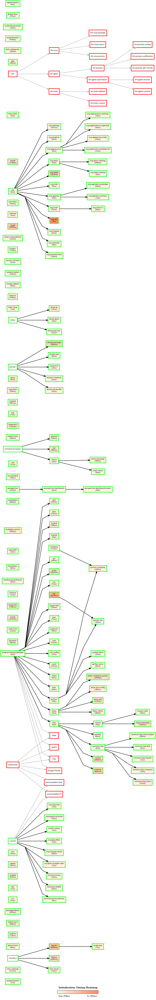

[[https://github.com/Dspil/guard.el/actions/workflows/ci.yml][https://github.com/Dspil/guard.el/actions/workflows/ci.yml/badge.svg]]
[[https://github.com/Dspil/guard.el/actions/workflows/melpazoid.yml][https://github.com/Dspil/guard.el/actions/workflows/melpazoid.yml/badge.svg]]
[[https://melpa.org/#/guard][file:https://melpa.org/packages/guard-badge.svg]]

* Overview

~guard~ is an Emacs package for modular, hierarchical configuration management. It allows you to organize your Emacs configuration into sections with dependency tracking, inheritance, conditional loading, mutual exclusion, and live introspection tools.

#+begin_quote
/Note: The first question I am always asked is "Why not use use-package?". ~guard~ is not a replacement, it is orthogonal and handles higher-level section management. In fact, my config uses both ~guard~ and ~use-package~ together./
#+end_quote

* Motivation
I wrote ~guard~ to make my life easier in sharing my init file across machines and time.

My init is getting quite large (for my taste). I like having it in a github repo to share it across machines and whenever I change something, I can sync all machines easily by pulling.

Each machine however needs some customization on top of that. Initially I would have an extra ~local-init.el~ loaded at the end of my init but I started wanting to *override* arbitrary sections of my initialization.

Also some machines don't even need all of the packages/customization I have in my config. For example, I might only want org-related sections on one machine because I don't code there and I only want it for notes. So I would like to be able to *enable* and *disable* parts of my configuration.

Enabling and disabling sections of the configuration was also appealing to me because I like to experiment with various programming languages and packages but, realistically, I won't be using them almost ever after I configure and play around a bit. But I don't want to remove that customization code because "what if I play with BQN again in the future?". The solutions is to just disable it until I need it again.

In fact, why not go one step further on the enabling/disabling front? Sometimes I want to have everything enabled by default and disable some sections of my configuration. Other times I want everything disabled by default and only selectively enable some sections of it. And it would also be nice if I could mix and match this behavior in different parts of the configuration.
Lastly, I like to try different packages/configurations achieving the same purpose but I don't want to delete the one I am not going with for now because I might change my mind. I would like the ability to *choose* between *mutually exclusive* alternatives and keep everything but the selected one disabled.

With this package I can achieve all of the above, and build some more nice quality of life features on top since I am creating the infrastructure.

** Example
I can split my configuration into sections. Sections can contain any piece of emacs lisp that I think tries to achieve some uniform purpose. Then I can define various operations on those sections on a different file I call the /tweak file/ which I just have to load before I load my config.

For example I have a section for configuring latex exporting for org-mode which I call ~org-latex~ and a section configuring org roam which I call ~org-roam~ (I know, fantastic names). I can name 'parents' to these sections and a very suitable parent is the section ~org~ (which doesn't have to exist or contain code, look at usage). Now If I am in a situation where I want to enable everything ~org~ related I can just:
#+begin_src emacs-lisp
  (guard-allow org)
#+end_src
Although everything is enabled by default so in an empty-tweak-file scenario, that is not needed. A parent might be disabled though so the allow command is useful there (look for the exact enabling/disabling rules below). Do I want to disallow everything org-related but only enable org-roam (for some reason)?
#+begin_src emacs-lisp
  (guard-disallow org
    (guard-allow org-roam))
#+end_src
I chose to allow nesting these statements to visually highlight the fact that we are trying to say "from org allow org-roam". The same though could be achieved by:
#+begin_src emacs-lisp
  (guard-disallow org)
  (guard-allow org-roam)
#+end_src
Now let's say I have a machine where all these are allowed, but my latex export has to be different:
#+begin_src emacs-lisp
  (guard-override over org-latex
    (my-awesome-new-org-latex-config))
#+end_src
and ~org-latex~ is replaced completely with the new config. What if I want to keep it but also prepend something to that section:
#+begin_src emacs-lisp
  (guard-override before org-latex
    (my-crucial-before-org-latex-config))
#+end_src
and using ~after~ works too in the opposite case.

** What now?
We have some nice infrastructure we can build some stuff on (and ideas are always welcome). So far these are:
- Mutually exclusive sections: A section can be defined as a ~xor~ section with some default child. All other children are automatically disabled. Of course the default child can be re-selected in the tweak file.
- Parameters: Named parameters in sections that can be explicitly overridden. Wait, can't you achieve the same with just a nested section? Yes, but it has to have a global unique name (instead of, for example, ~path~ which is a nice parameter for many sections at least in my case). It also allows for a nice macro to set any or all parameters of a section efficiently without needing to override.
- Graph visualization: I like to see my config and all the parent/child relationships. Calling ~guard-dot~ prints a dot version of the config which can later be rendered. The graph also contains init-time information per section.  as an example (feel free to dislike the init, but the graph looks cool!).
- More introspection: Calling ~guard-look~ and selecting a section jumps you to a buffer explaining what is up with that section, including its docstring, its status (enabled/disabled), parents and children.

* Usage

** Basic Usage

Call ~guard-initialize~ early in your ~init.el~. Then call ~guard-config~ to load the tweak-file. After that, wrap setup code in ~guard-section~ blocks:

#+BEGIN_SRC emacs-lisp
(require 'guard)
(guard-initialize)
(guard-config) ; Loads local tweaks from `guard-tweak-file`

(guard-section ui ()
  "Various ui options"
  (tool-bar-mode -1)
  (scroll-bar-mode -1))

(guard-section themes (:parents (ui))
  (load-theme 'modus-vivendi t))
#+END_SRC

Note that ~guard-config~ loads ~(locate-user-emacs-file "init-tweak.el")~ by default. This is customizable via the ~guard-tweak-file~ variable.

** Section Definition

A section is defined using the ~guard-section~ macro:

#+BEGIN_SRC emacs-lisp
(guard-section [name] (<options>)
  <optional docstring>
  <optional body>)
#+END_SRC

If a section starts with a string, that string acts as its docstring.

A section can contain parameters:

#+begin_src emacs-lisp
  (guard-section foo (:parents (bar))
    "Foo is a very important section doing important stuff."
    (config-something)
    (guard-param egg (default-egg-value)) ; look here
    (config-something-else))
#+end_src

An example of a section with an explicit parent and parameter:
#+begin_src emacs-lisp
  (guard-section org-roam (:parents (org))
    (setq org-roam-directory (guard-param path "path-to-knowledge"))
    ;; Won't bore you with details
    (configure-org-roam))
#+end_src

** Dependencies & Inheritance

A section can have any number of parent sections.

Sub-sections can be declared explicitly via ~:parents~:

#+BEGIN_SRC emacs-lisp
(guard-section lisp (:parents (programming))
  (add-hook 'emacs-lisp-mode-hook #'enable-paredit-mode))
#+END_SRC

or implicitly by nesting ~guard-section~ blocks within each other:

#+BEGIN_SRC emacs-lisp
(guard-section programming ()
  (guard-section lisp ()
    (add-hook 'emacs-lisp-mode-hook #'enable-paredit-mode)))
#+END_SRC

*** Key Principles
- *Automatic Definition:* Parents do not have to be declared beforehand. If a section is first introduced as a parent of a section currently being defined, the parent is defined at that moment.
- *Default Parent:* If a section has no explicit parents, its parent is either ~guard-parent-node~ or the wrapping section (the wrapping section has precedence).
- *Transitive Inheritance:* A section wrapped in another section will always have the wrapping section as a (maybe transitive) parent.

** Allowing & Disallowing Sections

Allowed sections will run during initialization, while disallowed sections will not.

*** Rules for Status
- A section is *allowed* if it is *explicitly allowed* OR if *all* of its parents are allowed.
- A section can also be *explicitly disallowed*, in which case it will not run.
- All sections are transitive children of ~guard-parent-node~, which is allowed by default. Therefore, with no extra configuration, all sections are allowed.
- Explicitly allowing/disallowing a section affects all transitive dependencies of that section.

*** Explicitly Allowing Sections (~guard-allow~)

#+BEGIN_SRC emacs-lisp
(guard-allow (section1 ...)
  <optional body>)
#+END_SRC

*** Explicitly Disallowing Sections (~guard-disallow~)

#+BEGIN_SRC emacs-lisp
(guard-disallow (section1 ...)
  <optional body>)
#+END_SRC

Both operations accept an optional body that executes *after* explicitly allowing or disallowing the argument sections. This allows nesting logic cleanly:

#+BEGIN_SRC emacs-lisp
;; Disallow all programming languages except python
(guard-disallow (programming-languages)
  (guard-allow (python)))
#+END_SRC

Note that the block syntax above is equivalent to sequential calls:

#+BEGIN_SRC emacs-lisp
(guard-disallow (programming-languages))
(guard-allow (python))
#+END_SRC

The optional body is provided as a visual convenience for logical grouping.

** Mutually Exclusive Sections

A section can specify a ~:default-child~ attribute to create mutually exclusive (~xor~) behavior:

#+BEGIN_SRC emacs-lisp
(guard-section completion (:default-child vertico))
#+END_SRC

In this case, ~completion~ becomes a ~xor~ section, and all of its child sections will be disabled except ~vertico~.

To override the selected child (as an alternative to using ~guard-allow~ / ~guard-disallow~), use ~guard-choose~:

#+BEGIN_SRC emacs-lisp
(guard-choose completion helm)
#+END_SRC

This makes ~helm~ the default selected child section instead.

** Overriding Sections

You can modify or override the behavior of an existing section using ~guard-override~:

#+BEGIN_SRC emacs-lisp
(guard-override <place> <section>
  <body>)
#+END_SRC

Valid values for ~<place>~:
- ~before~ :: ~<body>~ runs *before* the code in the target section.
- ~after~ :: ~<body>~ runs *after* the code in the target section.
- ~over~ :: ~<body>~ runs *instead of* the code in the target section.

Parameters can be set using ~guard-parameterize~:
#+begin_src emacs-lisp
  (guard-parameterize <section>
    (<param-name1> <param-value1>)
    (<param-name2> <param-value2>)
    ...)
#+end_src

** Introspection

Guard provides built-in interactive commands for inspecting your configuration graph and runtime status:

- ~M-x guard-dot~ :: Opens the ~*guard-dot*~ buffer containing a Graphviz DOT representation of your configuration hierarchy, along with runtime execution details for each section.
- ~M-x guard-look~ :: Inspects the status of a specific section along with its parent and child relationships.
